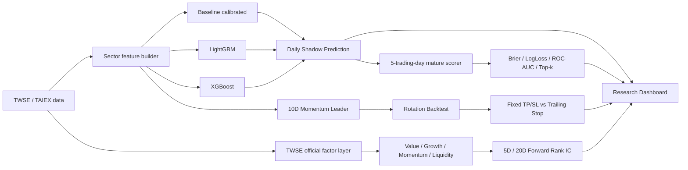

# Taiwan Sector Radar — 台股類股輪動 / ML Challenger

本專案把台股研究從單純「預測某檔股票會不會漲」改造成一條可驗證、可自動化、可持續累積 OOS（out-of-sample）證據的流程：

> **Momentum ranking → Trend confirmation → ML continuation probability → Portfolio rotation**

目前主線版本為 **v0.3.1 Challenger + v0.4 Rotation Validation + v0.5 Robustness Sweep**。核心原則是：**Baseline 先當 Champion，LightGBM / XGBoost 只當 Challenger；任何模型或策略都不能因為單次回測較漂亮就直接升級。**

## 1. 系統架構



## 2. v0.3.1 — Baseline vs LightGBM vs XGBoost

### 預測目標

`P(未來 5 個交易日類股報酬 > 同期 TAIEX 報酬)`

這是一個 cross-sectional relative-performance 分類問題，不預測精確股價。

### Leakage guardrail

歷史資料只有在完整 5 個交易日 forward label 已經成熟後，才可進入 training set。換句話說，預測當下最近尚未成熟的 5 個交易日不會被當成已知答案餵給模型。

### Features

- 5 / 10 / 20 日類股 momentum
- volume ratio
- MA20 breadth
- 20 日 realized volatility
- 5 / 20 日 relative return vs TAIEX
- baseline linear score
- sector one-hot

### 現行模型

- **Baseline**：既有 heuristic score + Logistic Regression calibration
- **LightGBM**：gradient boosted trees
- **XGBoost**：另一套 boosted-tree challenger

### 目前 chronological validation

訓練資料：3,630 mature samples、605 個日期；validation 726 samples。

| Model | Brier ↓ | Log loss ↓ | ROC-AUC ↑ |
|---|---:|---:|---:|
| **Baseline** | **0.2480** | **0.6891** | **0.5482** |
| XGBoost | 0.2645 | 0.7251 | 0.4674 |
| LightGBM | 0.2788 | 0.7587 | 0.4391 |

因此目前 **Baseline 仍是 Champion**。ML challengers 尚未達到 promotion gate。

### 第一筆 live Shadow

目前第一筆三模型共同 snapshot 為 `asOf=2026-08-11`。

- Baseline Top-1：PCB
- LightGBM Top-1：電子零組件
- XGBoost Top-1：電子零組件

這些 prediction 會等完整 5 個後續交易日成熟後，再自動計算真正 OOS 表現。

研究儀表板也會在三個模型欄位列出配置權重最高兩檔。這是把模型的六產業機率正規化為 100%，再將每個產業權重等分給三檔代表股的**配置 proxy**；它不是模型內部的個股重要度、實際持倉或投資建議。同權時依股票代碼排序，且 ML 與代表股快照日期不一致時不顯示權重。

### OOS 指標

- Brier score
- Log loss
- ROC-AUC（有兩類時）
- Top-1 hit rate
- Top-3 hit rate
- Brier wins

相關檔案：

- `data/shadow/challenger_predictions.jsonl`
- `data/shadow/challenger_scores.jsonl`
- `data/shadow/challenger_latest.json`
- `data/backtests/ml_challenger_v031.json`

## 3. v0.4 — Five-year Rotation Validation

回測區間：**2021-08-11 ～ 2026-08-11**。

訊號邏輯保留：

- trailing 10-trading-day sector momentum leader
- 只有 momentum > 0 才進場
- 收盤後產生 signal、下一交易日開盤執行
- 納入買賣手續費與賣出交易稅

### 5 年結果

| Strategy | Net return | CAGR | Max DD |
|---|---:|---:|---:|
| Fixed +20% / -20% | +185.48% | 24.33% | -59.09% |
| TP20 + Trail 8% | +683.64% | 53.32% | -47.81% |
| TP20 + Trail 10% | +334.10% | 35.63% | **-29.92%** |
| TP20 + Trail 12% | -27.96% | -6.58% | -38.72% |

**解讀重點：** trailing-stop 參數高度敏感，8% 並不能因為 backtest 報酬最高就被視為最佳答案。研究上目前較值得 forward-shadow 的是 **10% trailing stop**，因為風險/報酬形狀較平衡；最終仍以未來資料決定。

### 年度穩定性警告

固定 20/20 並不是每年穩定贏大盤，2022–2025 多個年度落後 TAIEX，而 2026 對總結果貢獻非常大。因此目前較合理的假說是：

> **Sector momentum / trend holding 可能有訊號，但高度 regime-dependent。**

## 3.5 v0.5 — 策略改善與參數穩健度

v0.4 的參數敏感度本身就是警訊：trailing stop 從 8% 移到 12%，五年結果從 +683.64% 變成 -27.96%。v0.5 針對這點與「只 gate 進場、不 gate 出場」做了三個引擎改動，並把「怎麼選設定」整個換掉。

### 引擎改動（`rotationBacktest.js`）

| 選項 | 作用 | 針對的問題 |
|---|---|---|
| `regimeFilter: { lookback, mode }` | TAIEX 對自身 MA 的 regime gate，可只擋進場或連同強制出場 | 部位可一路抱到 -20%（v0.4 首筆抱 210 個交易日，peak +14.7% → -24.0%） |
| `trailingStopVolMultiple` | 停損距離 = k × 籃子自身 20 日已實現波動，夾在 3%–30% | 固定百分比對航運與金融代表完全不同的意義 |
| `topK` | 同時持有動能前 K 名類股，資金平均分配 | 全押單一三檔籃子 |

`topK: 1` 且未設 regime filter 時，新引擎與 v0.4 引擎在 240 個合成情境下**逐筆交易與逐日淨值完全相同**，v0.3 / v0.4 已發佈數字仍可重現。

### 選設定的方式（`rotationRobustness.js`）

56 個設定（4 regime × 2 topK × 7 trailing），每個都跑完整視窗 + 前後半段 + 逐年。只差一個 trailing 參數的設定歸為同一個 **family**，用鄰域行為評分而不是單一最佳成員：

- `cagrSpread`（family 內 CAGR 極差）是脆弱度指標
- Promotion gate 要求 spread ≤ 35pp、`worstCalmar` ≥ 0.5、`medianCalmar` ≥ 0.8、沒有成員在後半段為負
- 通過後選的是 family 的**中位數參數**，不是表現最好的那個
- 沒有 family 通過時輸出 `no-promotion`

### 目前狀態

**v0.5 的真實五年數字尚未產生。** 開發環境不允許連線 TWSE，本次只用合成資料驗證程式路徑跑通，合成結果刻意沒有 commit。真實報告要等 `Rotation Robustness v0.5` workflow 在 Actions 上執行後才會出現在 `data/backtests/rotation_v0.5.{json,md}`。

細節見 `docs/ROTATION_V05.md`。

## 3.6 0050 對決 — 目前 0050 比較強

前面所有版本都拿 TAIEX 當基準，但 TAIEX 是價格指數，沒有人買得到。真正的對照組是 **0050**：可以買、會配息、而且是不跑這整套系統的人的預設選擇。

換成這個基準之後，用 repo 內既有的真實回測資料就能判定：

| | 五年總報酬 | MaxDD | 贏過大盤年數 |
|---|---:|---:|---:|
| v0.4 rotation（fixed 20/20） | +185.48% | **-59.09%** | 2 / 6 |
| TAIEX 價格指數 | +161.92% | — | — |
| TAIEX + 3.5%/年股息（0050 近似） | **+211.07%** | 約 -30% | — |

**含息之後策略是輸的**，而且回撤是兩倍，超額幾乎全部來自 2026 單一年份（2022–2025 連四年落後）。

### 為什麼會輸：成本

台股一趟買賣 0.1425% + 0.1425% + 0.3% = **0.585%**。五年做 150 次交易 ≈ 先賠掉 **60%** 的投入資金。10 日動能在六個類股間的排名幾乎每天洗牌，任何「排名變了就換股」的規則都會踩進去 —— 本次開發第一版 core-satellite 實測就做了 466 筆交易、其中 465 筆持有一天。

### Core-satellite：為了贏 0050 而設計

`coreSatellite.js` 的預設持倉就是 0050，只有真的有訊號時才偏離：

- 帳戶分 K 個 slot，有合格類股就持有類股籃子，否則持有 0050 —— 永遠不會在多頭裡空手
- **完全沒有訊號時，數學上等於 0050 買進持有**（測試驗證：報酬差 < 1e-9、beta = 1、tracking error = 0）
- `exitRankBuffer` / `minHoldingDays` / `rebalanceEvery` / `cooldownDays` 四道機制壓 turnover
- `maxSatelliteSlots` 控制 tracking error 上限
- 股息同時計入 benchmark 與策略 core 部位，兩邊都不能靠股息假設佔便宜
- 衡量指標含 IR、beta、up/down capture、**滾動一年勝率**、實付手續費

### 目前狀態

**真實數字尚未產生。** 開發環境只允許連 GitHub，TWSE / Yahoo / FinMind 全部被擋，拿不到 0050 真實價格。本次只用合成資料驗證程式路徑，合成資料在建構上就沒有橫斷面動能 edge，因此不能用來判斷策略好壞，產出也刻意沒有 commit。

執行 `Benchmark Battle vs 0050` workflow（或 `npm run battle:0050`）產生真實報告。判讀順序見 `docs/BENCHMARK_0050.md`。

## 3.7 TWSE 官方因子研究層

七端點每日快照現在會額外建立上市普通股的 point-in-time 因子排名：

- **Value**：低 PE、低 PB、高殖利率
- **Growth**：月營收 YoY、MoM、YTD 成長
- **Momentum**：當日價格動能
- **Liquidity**：成交金額可交易性控制
- **Composite**：35% Value + 35% Growth + 20% Momentum + 10% Liquidity

Universe 預設要求單日成交金額至少 2,000 萬元。缺值維持 `null`，重大訊息與 30 日內除權息另列風險提示，不用 AI 猜測，也不暗中改分數。

因子層不回填上線前績效。訊號從下一個已觀察收盤開始評估，逐日累積 5D／20D Rank IC、五分位差、Top 五分位換手率、成本後報酬估計與非重疊 Max Drawdown。未滿 20 個成熟 5D snapshots 時，一律標示 `collecting-forward-oos`，不宣稱有效。

資料檔：

- `data/dashboard/factor_forward.jsonl`：append-only point-in-time observations
- `data/dashboard/factor_outcomes.jsonl`：成熟後才追加的 OOS outcomes
- `data/dashboard/factor_research_latest.json`：前端使用的精簡排名與證據摘要

完整方法見 [`docs/FACTOR_RESEARCH.md`](docs/FACTOR_RESEARCH.md)。

## 4. TWSE 官方類股 proxy cross-check

使用 TWSE `EFTRI_HIST` 可直接對照的產業類股：

| Proxy | 與官方類股日報酬 correlation |
|---|---:|
| 半導體 | 0.864 |
| 電子零組件 | 0.838 |
| 金融 | 0.938 |

`AI伺服器` 與 `PCB` 目前仍屬 thematic proxy，不等同官方 point-in-time industry constituent reconstruction。

## 5. Champion / Challenger Promotion Gate

目前 promotion policy：

1. 不以單次 backtest 決定模型升級。
2. 必須累積足夠 matured forward OOS snapshots。
3. Challenger 至少要在 calibration（Brier）、ranking（Top-k / ROC-AUC）上持續勝出。
4. 必須跨不同 market regimes，而不是只靠單一強勢年份。
5. 策略層還要同時考慮 drawdown、turnover、交易成本與參數穩定性。
6. 策略設定必須通過 v0.5 robustness gate：鄰近參數也要能用，且採用的是 family 的中位數參數而非最佳參數。
7. 策略必須在**含息**的基礎上贏過 0050，而不只是贏過 TAIEX 價格指數。

## 6. 自動化排程

| 排程 | Cron (UTC) | 台北時間 | 內容 |
|---|---|---|---|
| `sector-shadow.yml` | `30 7 * * 1-5` | 平日 15:30 | Daily Shadow inference + mature scoring |
| `ml-challenger-train.yml` | `0 2 * * 0` | 週日 10:00 | 重新訓練 Baseline calibrator、LightGBM、XGBoost |
| `weekly-research.yml` | `0 1 * * 6` | **週六 09:00** | 抓一次 TWSE 資料，跑 0050 對決 + v0.5 robustness sweep |
| `dashboard-market-schedule.yml` | `20 8 * * 1-5` | 平日 16:20 | 七端點官方快照 + 因子排名 + matured OOS scoring |

`weekly-research.yml` 是唯一會自動抓資料做策略比較的排程。它刻意**只抓一次**：

1. 先跑 `runBenchmarkBattle.js --refresh` —— 這支需要的 symbol 最多（18 檔類股成分 + 0050），下載後寫入快取
2. 再跑 `runRotationV05.js --offline` —— 只需要那 18 檔，直接重用同一份快取

用 `--offline` 而不是讓它自己重抓，是為了保證兩份報告一定出自同一個 snapshot；快取不在就直接失敗，而不是默默抓到不同的資料。

以下維持手動 (`workflow_dispatch`)，供臨時單獨執行：`rotation-v04.yml`、`rotation-v05.yml`、`benchmark-battle-0050.yml`。

> **注意：** GitHub 的 scheduled workflow 只會從 **default branch** 執行。這些檔案還在 `claude/improvement-strategy-9t1zar` 上，**合併進 `main` 之前 cron 不會啟動**。

GitHub Actions：

- `.github/workflows/ml-challenger-train.yml`
- `.github/workflows/sector-shadow.yml`
- `.github/workflows/rotation-v04.yml`
- `.github/workflows/rotation-v05.yml`
- `.github/workflows/benchmark-battle-0050.yml`
- `.github/workflows/weekly-research.yml`
- `.github/workflows/pages.yml`

## 7. Research Dashboard

GitHub Pages 會部署一個純靜態 Dashboard，直接讀 repo 內最新資料：

- `data/shadow/challenger_latest.json`
- `data/backtests/ml_challenger_v031.json`
- `data/backtests/rotation_v0.4.json`
- `data/dashboard/factor_research_latest.json`

Dashboard 顯示：

- 最新 as-of date / model trained-through
- 三模型每個類股的 continuation probability 與排名
- validation Brier / Log-loss / ROC-AUC
- forward OOS 累積分數
- 5Y rotation / trailing-stop 策略比較
- TWSE official proxy correlation
- 官方 Value / Growth / Momentum / Liquidity 排名
- 5D / 20D 因子 Rank IC、五分位差、換手與回撤證據

另有投資人教育頁 `time-series-guide.html`，用非技術讀者可理解的順序介紹時間序列、方法選擇、Walk-forward 與 Forward OOS。文章內容架構見 [`docs/TIME_SERIES_ANALYSIS_GUIDE.md`](docs/TIME_SERIES_ANALYSIS_GUIDE.md)。

### 網頁入口

- [Research Dashboard](https://s0914712.github.io/STOCK/)
- [時間序列分析入門](https://s0914712.github.io/STOCK/time-series-guide.html)

### 一次性 GitHub Pages 設定

GitHub App 可以建立與執行 Pages workflow，但無法替 repository 第一次開啟 Pages。Repo owner 需做一次：

1. `Settings` → `Pages`
2. `Build and deployment` → `Source`
3. 選擇 `GitHub Actions`
4. 回到 `Actions` 手動執行 `Deploy Research Dashboard`，或在 workflow 合併到 `main` 後由資料更新自動部署

第一次啟用後，後續 Shadow / backtest JSON 更新會自動重新部署，不需手動修改 HTML。

## 8. Repo map

```text
STOCK/
├─ sectorRadar.js                 # sector feature/ranking baseline
├─ mlChallenger.py                # ML feature/model/scoring core
├─ rotationBacktest.js            # rotation backtest engine (regime gate, vol stop, topK)
├─ rotationRobustness.js          # parameter sweep, family scoring, promotion gate
├─ coreSatellite.js               # 0050-core + sector-satellite engine and benchmark stats
├─ factorResearch.js              # official cross-sectional factor + forward OOS scorer
├─ scripts/
│  ├─ shadowRunner.js
│  ├─ trainMlChallenger.py
│  ├─ runMlShadow.py
│  ├─ twseData.js                 # shared TWSE fetch + on-disk cache
│  ├─ runDashboardMarketSnapshot.js
│  ├─ runFactorResearch.js
│  ├─ runRotationV04.js
│  ├─ runRotationV05.js
│  └─ runBenchmarkBattle.js
├─ data/
│  ├─ shadow/                     # append-only OOS ledgers + latest snapshot
│  ├─ dashboard/                  # official snapshot + factor forward ledgers
│  ├─ models/                     # trained challenger artifacts
│  ├─ cache/                      # TWSE price snapshot (gitignored)
│  └─ backtests/                  # ML validation + rotation reports
├─ public/
│  ├─ research-dashboard.html
│  ├─ research-dashboard.css
│  ├─ research-dashboard.js
│  ├─ time-series-guide.html
│  └─ time-series-guide.css
├─ docs/
│  ├─ SECTOR_RADAR.md
│  ├─ CHALLENGER_V031_V04.md
│  ├─ ROTATION_V05.md
│  ├─ BENCHMARK_0050.md
│  ├─ FACTOR_RESEARCH.md
│  └─ TIME_SERIES_ANALYSIS_GUIDE.md
└─ .github/workflows/
```

## 9. 研究限制

- 代表股 universe 仍有 curated-universe / hindsight-selection 風險。
- thematic sectors 尚未完整重建 historical point-in-time constituents。
- Backtest 不等於 live trading performance。
- 目前 OOS live sample 很少，還不足以宣告 ML 或 trailing-stop challenger 勝出。
- 因子研究從正式上線日起 forward 累積；未滿門檻前排名只有研究用途，不能視為已驗證 alpha。
- 本專案為研究用途，不構成投資建議。
