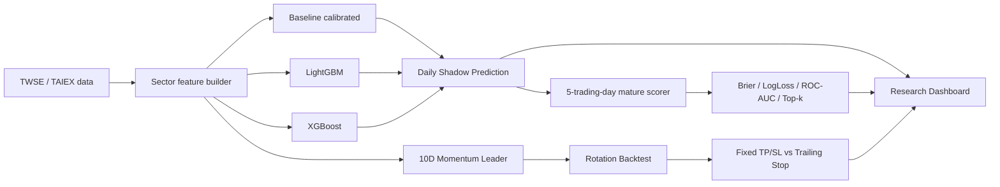

# Taiwan Sector Radar — 台股類股輪動 / ML Challenger

本專案把台股研究從單純「預測某檔股票會不會漲」改造成一條可驗證、可自動化、可持續累積 OOS（out-of-sample）證據的流程：

> **Momentum ranking → Trend confirmation → ML continuation probability → Portfolio rotation**

目前主線版本為 **v0.3.1 Challenger + v0.4 Rotation Validation**。核心原則是：**Baseline 先當 Champion，LightGBM / XGBoost 只當 Challenger；任何模型或策略都不能因為單次回測較漂亮就直接升級。**

## 1. 系統架構



## 2. v0.3.1 — Baseline vs LightGBM vs XGBoost

### 預測目標

`P(未來 5 個交易日類股報酬 > 同期 TAIEX 報酬)`

這是一個 cross-sectional relative-performance 分類問題，不預測精確股價。

### Leakage guardrail

歷史資料只有在完整 5 個交易日 forward label 已經成熟後，才可進入 training set。換句話說，預測當下最近尚未成熟的 5 個交易日不會被當成已知答案餵給模型。

### Features

- 5 / 10 / 20 日類股 momentum
- volume ratio
- MA20 breadth
- 20 日 realized volatility
- 5 / 20 日 relative return vs TAIEX
- baseline linear score
- sector one-hot

### 現行模型

- **Baseline**：既有 heuristic score + Logistic Regression calibration
- **LightGBM**：gradient boosted trees
- **XGBoost**：另一套 boosted-tree challenger

### 目前 chronological validation

訓練資料：3,630 mature samples、605 個日期；validation 726 samples。

| Model | Brier ↓ | Log loss ↓ | ROC-AUC ↑ |
|---|---:|---:|---:|
| **Baseline** | **0.2480** | **0.6891** | **0.5482** |
| XGBoost | 0.2645 | 0.7251 | 0.4674 |
| LightGBM | 0.2788 | 0.7587 | 0.4391 |

因此目前 **Baseline 仍是 Champion**。ML challengers 尚未達到 promotion gate。

### 第一筆 live Shadow

目前第一筆三模型共同 snapshot 為 `asOf=2026-08-11`。

- Baseline Top-1：PCB
- LightGBM Top-1：電子零組件
- XGBoost Top-1：電子零組件

這些 prediction 會等完整 5 個後續交易日成熟後，再自動計算真正 OOS 表現。

### OOS 指標

- Brier score
- Log loss
- ROC-AUC（有兩類時）
- Top-1 hit rate
- Top-3 hit rate
- Brier wins

相關檔案：

- `data/shadow/challenger_predictions.jsonl`
- `data/shadow/challenger_scores.jsonl`
- `data/shadow/challenger_latest.json`
- `data/backtests/ml_challenger_v031.json`

## 3. v0.4 — Five-year Rotation Validation

回測區間：**2021-08-11 ～ 2026-08-11**。

訊號邏輯保留：

- trailing 10-trading-day sector momentum leader
- 只有 momentum > 0 才進場
- 收盤後產生 signal、下一交易日開盤執行
- 納入買賣手續費與賣出交易稅

### 5 年結果

| Strategy | Net return | CAGR | Max DD |
|---|---:|---:|---:|
| Fixed +20% / -20% | +185.48% | 24.33% | -59.09% |
| TP20 + Trail 8% | +683.64% | 53.32% | -47.81% |
| TP20 + Trail 10% | +334.10% | 35.63% | **-29.92%** |
| TP20 + Trail 12% | -27.96% | -6.58% | -38.72% |

**解讀重點：** trailing-stop 參數高度敏感，8% 並不能因為 backtest 報酬最高就被視為最佳答案。研究上目前較值得 forward-shadow 的是 **10% trailing stop**，因為風險/報酬形狀較平衡；最終仍以未來資料決定。

### 年度穩定性警告

固定 20/20 並不是每年穩定贏大盤，2022–2025 多個年度落後 TAIEX，而 2026 對總結果貢獻非常大。因此目前較合理的假說是：

> **Sector momentum / trend holding 可能有訊號，但高度 regime-dependent。**

## 4. TWSE 官方類股 proxy cross-check

使用 TWSE `EFTRI_HIST` 可直接對照的產業類股：

| Proxy | 與官方類股日報酬 correlation |
|---|---:|
| 半導體 | 0.864 |
| 電子零組件 | 0.838 |
| 金融 | 0.938 |

`AI伺服器` 與 `PCB` 目前仍屬 thematic proxy，不等同官方 point-in-time industry constituent reconstruction。

## 5. Champion / Challenger Promotion Gate

目前 promotion policy：

1. 不以單次 backtest 決定模型升級。
2. 必須累積足夠 matured forward OOS snapshots。
3. Challenger 至少要在 calibration（Brier）、ranking（Top-k / ROC-AUC）上持續勝出。
4. 必須跨不同 market regimes，而不是只靠單一強勢年份。
5. 策略層還要同時考慮 drawdown、turnover、交易成本與參數穩定性。

## 6. 自動化排程

- **週日 10:00 Asia/Taipei**：重新訓練 Baseline calibrator、LightGBM、XGBoost
- **週一至週五 15:30 Asia/Taipei**：Daily Shadow inference + mature scoring
- v0.4 5Y validation：research/manual workflow，需要時重新執行

GitHub Actions：

- `.github/workflows/ml-challenger-train.yml`
- `.github/workflows/sector-shadow.yml`
- `.github/workflows/rotation-v04.yml`
- `.github/workflows/pages.yml`

## 7. Research Dashboard

GitHub Pages 會部署一個純靜態 Dashboard，直接讀 repo 內最新資料：

- `data/shadow/challenger_latest.json`
- `data/backtests/ml_challenger_v031.json`
- `data/backtests/rotation_v0.4.json`

Dashboard 顯示：

- 最新 as-of date / model trained-through
- 三模型每個類股的 continuation probability 與排名
- validation Brier / Log-loss / ROC-AUC
- forward OOS 累積分數
- 5Y rotation / trailing-stop 策略比較
- TWSE official proxy correlation

預期正式入口：`https://s0914712.github.io/STOCK/`

### 一次性 GitHub Pages 設定

GitHub App 可以建立與執行 Pages workflow，但無法替 repository 第一次開啟 Pages。Repo owner 需做一次：

1. `Settings` → `Pages`
2. `Build and deployment` → `Source`
3. 選擇 `GitHub Actions`
4. 回到 `Actions` 手動執行 `Deploy Research Dashboard`，或在 workflow 合併到 `main` 後由資料更新自動部署

第一次啟用後，後續 Shadow / backtest JSON 更新會自動重新部署，不需手動修改 HTML。

## 8. Repo map

```text
STOCK/
├─ sectorRadar.js                 # sector feature/ranking baseline
├─ mlChallenger.py                # ML feature/model/scoring core
├─ rotationBacktest.js            # rotation backtest engine
├─ scripts/
│  ├─ shadowRunner.js
│  ├─ trainMlChallenger.py
│  ├─ runMlShadow.py
│  └─ runRotationV04.js
├─ data/
│  ├─ shadow/                     # append-only OOS ledgers + latest snapshot
│  ├─ models/                     # trained challenger artifacts
│  └─ backtests/                  # ML validation + rotation reports
├─ public/
│  ├─ research-dashboard.html
│  ├─ research-dashboard.css
│  └─ research-dashboard.js
├─ docs/
│  ├─ SECTOR_RADAR.md
│  └─ CHALLENGER_V031_V04.md
└─ .github/workflows/
```

## 9. 研究限制

- 代表股 universe 仍有 curated-universe / hindsight-selection 風險。
- thematic sectors 尚未完整重建 historical point-in-time constituents。
- Backtest 不等於 live trading performance。
- 目前 OOS live sample 很少，還不足以宣告 ML 或 trailing-stop challenger 勝出。
- 本專案為研究用途，不構成投資建議。
