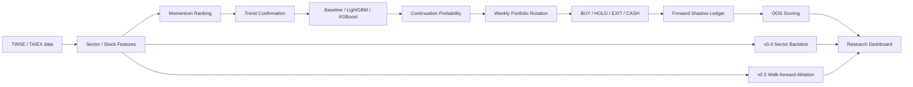

# Taiwan Momentum Rotation Lab — 台股類股輪動 / ML Challenger

本專案把台股研究從單純「預測某檔股票會不會漲」改造成一條可驗證、可自動化、可持續累積 OOS（out-of-sample）證據的流程：

> **Momentum ranking → Trend confirmation → ML continuation probability → Portfolio rotation**

目前研究分成兩條互補主線：

- **v0.3.1 / v0.4**：sector-level Baseline / LightGBM / XGBoost Shadow + 類股輪動基準。
- **v0.5 Momentum Rotation Challenger**：把訊號下推到 stock-level，預測「10 日趨勢續航」，再轉成可回測、可 Shadow 的投資組合決策。

核心原則：**簡單規則先當 Champion；任何 ML 或 portfolio rule 都不能因為單次回測較漂亮就直接升級。**

## 1. 系統架構



## 2. v0.3.1 — Sector Baseline vs LightGBM vs XGBoost

### Target

`P(未來 5 個交易日類股報酬 > 同期 TAIEX 報酬)`

這是一個 cross-sectional relative-performance 分類問題，不預測精確股價。

### Leakage guardrail

歷史資料只有在完整 5 個交易日 forward label 已經成熟後，才可進入 training set。預測當下最近尚未成熟的 5 個交易日不會被當成已知答案餵給模型。

### Features

- 5 / 10 / 20 日類股 momentum
- volume ratio
- MA20 breadth
- 20 日 realized volatility
- 5 / 20 日 relative return vs TAIEX
- baseline linear score
- sector one-hot

### Chronological validation

| Model | Brier ↓ | Log loss ↓ | ROC-AUC ↑ |
|---|---:|---:|---:|
| **Baseline** | **0.2480** | **0.6891** | **0.5482** |
| XGBoost | 0.2645 | 0.7251 | 0.4674 |
| LightGBM | 0.2788 | 0.7587 | 0.4391 |

因此 **v0.3.1 Baseline 仍是 sector Champion**。ML challengers 尚未達到 promotion gate。

### Live Shadow

第一筆共同 snapshot 為 `asOf=2026-08-11`：

- Baseline Top-1：PCB
- LightGBM Top-1：電子零組件
- XGBoost Top-1：電子零組件

每筆 prediction 等完整 5 個後續交易日成熟後，再自動計算 Brier、Log loss、ROC-AUC、Top-1 / Top-3 hit 與 Brier wins。

## 3. v0.4 — Five-year Sector Rotation Validation

回測區間：**2021-08-11 ～ 2026-08-11**。

| Strategy | Net return | CAGR | Max DD |
|---|---:|---:|---:|
| Fixed +20% / -20% | +185.48% | 24.33% | -59.09% |
| TP20 + Trail 8% | +683.64% | 53.32% | -47.81% |
| TP20 + Trail 10% | +334.10% | 35.63% | **-29.92%** |
| TP20 + Trail 12% | -27.96% | -6.58% | -38.72% |

Trailing-stop 對參數高度敏感，8% 並不能因為 backtest 報酬最高就被視為最佳答案。固定 20/20 在 2022–2025 多個年度落後 TAIEX，而 2026 對總結果貢獻非常大，因此較合理的假說是：

> **Sector momentum / trend holding 可能有訊號，但高度 regime-dependent。**

## 4. v0.5 — Momentum Rotation Challenger

v0.5 不再只問「哪個類股最強」，而是把研究拆成四層：

| Layer | 任務 | 輸出 |
|---|---|---|
| Momentum ranking | 找相對強勢股 | 5 / 10 / 20 / 60D composite rank |
| Trend confirmation | 過濾短期暴衝 / 假突破 | MA alignment、slope、volume、distance |
| ML continuation | 預估未來 10D 趨勢是否續航 | Baseline / LGBM / XGB probabilities |
| Portfolio rotation | 買進、續抱、退出、權重 | action / target weight / exit reason |

### 4.1 Momentum + Trend

Momentum score 使用 cross-sectional z-score：

- 5D：15%
- 10D：25%
- 20D：30%
- 60D：30%

Trend gate：

- `Close > MA20 > MA60`
- MA20 5D slope > 0
- 5D / 20D volume ratio ≥ 0.80
- `0 < distance_to_MA20 ≤ 20%`

### 4.2 ML continuation label

模型不學「明天漲不漲」，而學：

```text
future_10d_stock_return > future_10d_TAIEX_return + 1.0% cost buffer
AND
forward_10d_max_drawdown >= -10%
```

任何 row 只有在完整 10 個交易日的 forward path 已成熟後才可進 training set。

### 4.3 v0.5 真實 chronological validation

目前資料：**24,377 mature samples / 1,375 trading dates**；validation split `2025-06-13`，validation 4,853 samples。

| Model | Brier ↓ | Log loss ↓ | ROC-AUC ↑ |
|---|---:|---:|---:|
| **Baseline** | **0.2230** | **0.6385** | 0.5357 |
| LightGBM | 0.2234 | 0.6392 | 0.5214 |
| XGBoost | 0.2236 | 0.6396 | 0.4997 |
| OOS ensemble | 0.2232 | 0.6389 | **0.5400** |

目前結論仍是 **不升級 ML**：Baseline 的 calibration 最好；ensemble 雖然 ROC-AUC 稍高，但幅度不足以單獨構成 promotion。

### 4.4 Portfolio rules

- 每週一次新增部位機會，收盤產生 signal、下一交易日 open 模擬成交。
- Entry：Momentum Top-5 + Trend pass + continuation probability ≥ 0.60。
- 最多 5 檔，等權；沒有合格股票時保留現金。
- Hysteresis：Top-5 才買；已持有者可保留至 rank > 10。
- Probability hysteresis：entry ≥ 0.60；exit < 0.50。
- 提前退出：trend fail / probability drop / rank drop。
- Hard boundaries：+20% take-profit / -20% stop-loss。

### 4.5 Costs

- Buy commission：0.1425%
- Sell commission：0.1425%
- Sell stock transaction tax：0.30%
- Slippage：0.10% per side
- ML target 額外要求 1.0% cost buffer

### 4.6 Walk-forward ablation design

所有層級共用同一批 **monthly expanding walk-forward OOS predictions**：

1. Momentum only
2. Momentum + Trend
3. Baseline probability
4. LightGBM
5. XGBoost
6. OOS ensemble
7. Full Portfolio rotation

某月開始預測前，training rows 必須滿足 `targetDate < 該月第一個預測日`，避免 overlapping 10D labels 洩漏進模型。

### 4.7 5Y walk-forward 實際結果

回測期間：**2021-08-11 ～ 2026-08-12**。

| Layer | Net return | CAGR | Max DD | Sharpe | Turnover | Precision@K | Excess vs TAIEX | Excess vs split-adjusted 0050 |
|---|---:|---:|---:|---:|---:|---:|---:|---:|
| **Momentum only** | **+92.63%** | 14.57% | -54.15% | 0.53 | 184.77x | 38.60% | -71.59% | -120.58% |
| Momentum + Trend | -16.77% | -3.74% | -57.77% | 0.10 | 260.87x | 38.83% | -181.00% | -229.99% |
| Baseline probability | 0.00% | 0.00% | 0.00% | — | 0.00x | — | -164.22% | -213.21% |
| LightGBM | 0.00% | 0.00% | 0.00% | — | 0.00x | — | -164.22% | -213.21% |
| XGBoost | 0.00% | 0.00% | 0.00% | — | 0.00x | — | -164.22% | -213.21% |
| OOS ensemble | 0.00% | 0.00% | 0.00% | — | 0.00x | — | -164.22% | -213.21% |
| Full Portfolio | 0.00% | 0.00% | 0.00% | — | 0.00x | — | -164.22% | -213.21% |

0050 benchmark 使用 TWSE `STOCK_DAY` raw price 並對 **2025-06-18 生效的 4:1 分割**做 split adjustment；目前比較的是 price return，未將配息再投資。

**v0.5.0 明確未通過 promotion gate：**

- Momentum-only 雖為正報酬，但 Max DD -54.15%、turnover 184.77x，且落後 TAIEX / 0050。
- 現行 Trend gate 並未改善 momentum，反而把績效降到 -16.77% 並增加 turnover。
- 0.60 absolute probability gate 過嚴，Baseline / LightGBM / XGBoost / ensemble / full portfolio 五層全部零交易。
- 因此目前沒有證據顯示 ML 對 `Momentum + Trend` 增加可投資價值，也沒有模型可以升級 Champion。

下一版研究方向應先處理 **threshold calibration / trend-filter ablation / turnover control**，而不是直接增加模型複雜度。

Portfolio promotion 主要比較：

- after-cost net return
- excess vs TAIEX
- excess vs 0050
- Max Drawdown
- Sharpe
- turnover
- Precision@K

## 5. TWSE 官方類股 proxy cross-check

| Proxy | 與官方類股日報酬 correlation |
|---|---:|
| 半導體 | 0.864 |
| 電子零組件 | 0.838 |
| 金融 | 0.938 |

`AI伺服器` 與 `PCB` 目前仍屬 thematic proxy，不等同官方 point-in-time industry constituent reconstruction。

## 6. Shadow ledgers

### Sector v0.3.1

- `data/shadow/challenger_predictions.jsonl`
- `data/shadow/challenger_scores.jsonl`
- `data/shadow/challenger_latest.json`

### Momentum Rotation v0.5

- `data/shadow/momentum_v05_predictions.jsonl`
- `data/shadow/momentum_v05_scores.jsonl`
- `data/shadow/momentum_v05_latest.json`

每個 v0.5 stock row 保存：

```text
momentum_score
momentum_rank
trend_pass
baseline_probability
lightgbm_probability
xgboost_probability
calibrated_probability
portfolio_action
target_weight
exit_reason
estimated_cost
realized_return
```

Prediction ledger append-only；`realized_return` 預測當下為 `null`，10D outcome 成熟後寫入 score ledger，不回頭修改 prediction snapshot。

第一筆真實 v0.5 Shadow：`asOf=2026-08-12`。當日不是 weekly rotation day，且 Top-5 中唯一通過 Trend gate 的 3008 ensemble probability 約 35%，低於 60% entry gate，因此組合正確保持 **100% CASH**。

## 7. Champion / Challenger Promotion Gate

1. 不以單次 backtest 或單一 AUC 決定升級。
2. 必須累積足夠 matured forward OOS snapshots。
3. Prediction 層看 calibration / Brier、ROC-AUC、Precision@K。
4. Portfolio 層看扣成本報酬、Max DD、Sharpe、turnover、0050 / TAIEX excess。
5. 必須跨不同 market regimes，而不是只靠單一強勢年份。
6. 若 ML 無法勝過 Momentum + Trend，ML 繼續留在 Shadow。

## 8. 自動化排程

- **v0.3.1 週日 10:00 Asia/Taipei**：Sector Baseline / LightGBM / XGBoost retrain
- **v0.3.1 週一至週五 15:30**：Sector Shadow + mature scoring
- **v0.5 週日 11:00 Asia/Taipei**：10D continuation models retrain
- **v0.5 週一至週五 15:40**：Momentum Rotation Shadow decision + mature scoring
- v0.4 / v0.5 5Y backtests：manual research workflows

## 9. Research Dashboard

GitHub Pages 使用 **GitHub Actions workflow deployment**，入口：

`https://s0914712.github.io/STOCK/`

Dashboard 直接讀 repo JSON，顯示：

- v0.3.1 Sector Shadow probabilities / ranking / OOS scoreboard
- v0.4 5Y sector rotation comparison
- v0.5 Momentum rank / Trend gate / continuation probability
- v0.5 BUY / HOLD / EXIT / target weight
- v0.5 7-layer walk-forward ablation
- TWSE official proxy correlation

## 10. Repo map

```text
STOCK/
├─ sectorRadar.js
├─ mlChallenger.py
├─ rotationBacktest.js
├─ momentumV05Features.py
├─ momentumV05Models.py
├─ momentumV05Backtest.py
├─ scripts/
│  ├─ shadowRunner.js
│  ├─ trainMlChallenger.py
│  ├─ runMlShadow.py
│  ├─ runRotationV04.js
│  ├─ trainMomentumV05.py
│  ├─ runMomentumV05Backtest.py
│  ├─ runMomentumV05Shadow.py
│  └─ selfTestMomentumV05.py
├─ data/
│  ├─ shadow/
│  ├─ models/
│  └─ backtests/
├─ public/
│  ├─ research-dashboard.html
│  ├─ research-dashboard.css
│  └─ research-dashboard.js
├─ docs/
│  ├─ SECTOR_RADAR.md
│  ├─ CHALLENGER_V031_V04.md
│  ├─ MOMENTUM_ROTATION_V05_DESIGN.md
│  └─ MOMENTUM_ROTATION_V05.md
└─ .github/workflows/
```

## 11. 研究限制

- v0.5 第一版仍只使用目前 curated 18-stock research universe，存在 hindsight / survivorship-selection risk。
- thematic sectors 尚未完整重建 historical point-in-time constituents。
- 0050 benchmark 目前為 split-adjusted **price return**，不是含息 total return。
- 目前 v0.5 live OOS sample 尚少；v0.5.0 已因 walk-forward 結果不佳而維持 Challenger / Shadow，不應用於 production allocation。
- Backtest / Shadow 都不等於實際成交績效；真實 liquidity、partial fills、limit moves 與券商費率仍可能不同。
- 本專案為研究用途，不構成投資建議。
